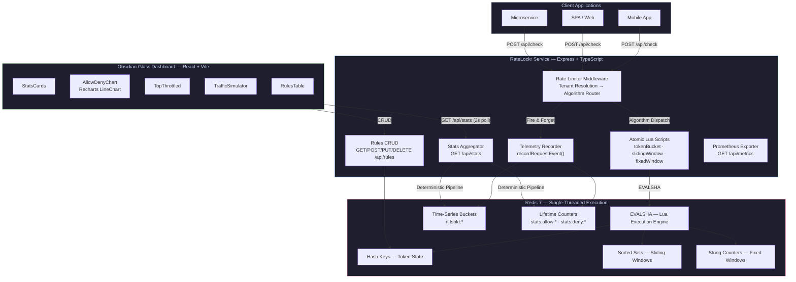

<div align="center">

# 🔐 RateLockr

**Distributed, Multi-Tenant Rate-Limiting Microservice Gateway**
**with Real-Time Administrative Telemetry Dashboard**

[](https://www.typescriptlang.org/)
[](https://nodejs.org/)
[](https://redis.io/)
[](https://react.dev/)
[](https://vitejs.dev/)
[](LICENSE)
[](https://render.com/)
[](https://vercel.com/)

---

A high-throughput, language-agnostic rate-limiting microservice that evaluates every request decision inside **atomic Lua scripts** executed within Redis's single-threaded command loop — eliminating distributed race conditions at the protocol level.

The companion **Obsidian Glass** admin dashboard provides real-time telemetry, per-tenant drill-down, rule CRUD, and live traffic simulation with a WebGL fluid-cursor interface.

[**Live Dashboard →**](https://rate-lockr.vercel.app) &nbsp;|&nbsp; [**API Endpoint →**](https://ratelockr-api.onrender.com/health)

</div>

---

## Table of Contents

- [System Architecture](#system-architecture)
- [Rate-Limiting Algorithms](#rate-limiting-algorithms)
- [Redis Key Schema](#redis-key-schema)
- [Telemetry Pipeline](#telemetry-pipeline)
- [API Reference](#api-reference)
- [Dashboard](#dashboard)
- [Project Structure](#project-structure)
- [Local Development](#local-development)
- [Deployment](#deployment)
- [Tech Stack](#tech-stack)

---

## System Architecture



> **Design Principle:** Every rate-limit decision is computed inside a single `EVALSHA` call. Because Redis executes Lua scripts atomically within its single-threaded event loop, no distributed locks, mutexes, or CAS retries are required — even under concurrent load across multiple application instances.

---

## Rate-Limiting Algorithms

RateLockr ships with three production-hardened algorithms, each implemented as a self-contained Lua script with a TypeScript wrapper that provides fail-open degradation.

### Token Bucket

> Best for: **Steady-state throughput with burst tolerance**

```
Refill Formula:  tokens = min(tokens + (Δt × refill_rate), capacity)
Decision:        tokens ≥ cost → ALLOW (deduct cost) : DENY
TTL:             ⌈(capacity / refill_rate) × 2⌉ seconds
```

| Redis Structure | Key Pattern | Fields |
|:--|:--|:--|
| Hash | `rl:tb:{clientId}:{endpoint}` | `tokens`, `last_refill` |

The script performs lazy initialization — on first contact the bucket starts at full `capacity`. Time-based refill is computed on every evaluation using millisecond-precision elapsed time, guarding against clock skew with `math.max(delta, 0)`.

### Sliding Window Log

> Best for: **Strict per-window enforcement with no boundary edge cases**

```
Eviction:   ZREMRANGEBYSCORE key -inf (now - windowSizeMs)
Count:      ZCARD key
Decision:   count < capacity → ZADD unique_member : DENY
```

| Redis Structure | Key Pattern | Member |
|:--|:--|:--|
| Sorted Set | `rl:sw:{clientId}:{endpoint}` | `crypto.randomUUID()` scored by timestamp |

Each request inserts a unique UUID member scored by its arrival timestamp. Expired entries are atomically pruned before counting. This eliminates the boundary-crossing artifacts inherent in fixed window counters.

### Fixed Window Counter

> Best for: **Simple, memory-efficient rate limiting at scale**

```
Increment:  INCRBY key cost
Decision:   count ≤ capacity → ALLOW (set PEXPIRE) : DENY (DECRBY cost)
```

| Redis Structure | Key Pattern |
|:--|:--|
| String (integer) | `rl:fw:{clientId}:{endpoint}` |

The lightest algorithm — a single key per client-endpoint pair. The counter auto-expires at the end of each window. Denied requests are decremented back to prevent counter inflation.

### Fail-Open Guarantee

All three wrappers implement identical error handling:

```typescript
catch (err) {
  logger.error({ err, key, clientId, endpoint }, "Check failed — failing open");
  return { allowed: true, remaining: -1 };  // remaining: -1 signals degraded mode
}
```

> **A Redis outage must never cascade into a total traffic block on dependent services.** When `remaining === -1`, upstream callers know the decision was made without Redis and can apply compensating controls.

---

## Redis Key Schema

All keys are namespaced under the `rl:` prefix to isolate rate-limiting state from other Redis workloads. Key builders are centralized in [`keys.ts`](api/src/lib/keys.ts).

| Domain | Pattern | Type | TTL | Purpose |
|:--|:--|:--|:--|:--|
| Token Bucket | `rl:tb:{client}:{endpoint}` | Hash | Dynamic¹ | Bucket state |
| Sliding Window | `rl:sw:{client}:{endpoint}` | Sorted Set | `windowSizeMs` | Request log |
| Fixed Window | `rl:fw:{client}:{endpoint}` | String | `windowSizeSeconds` | Request counter |
| Rules | `rl:rules:{clientId}` | Hash | Persistent | Client rule configs |
| Time-Series (global) | `rl:tsbkt:g:{field}:{epoch_sec}` | String | 120s | Per-second traffic counters |
| Time-Series (client) | `rl:tsbkt:{client}:{field}:{epoch_sec}` | String | 120s | Per-client traffic counters |
| Lifetime Allow | `stats:allow:{clientId}` | String | Persistent | Cumulative allow counter |
| Lifetime Deny | `stats:deny:{clientId}` | String | Persistent | Cumulative deny counter |

> ¹ Token Bucket TTL is computed dynamically: `⌈(capacity / refill_rate) × 2⌉` seconds — idle buckets self-evict.

---

## Telemetry Pipeline

RateLockr implements a **deterministic time-series pipeline** that avoids the overhead and non-determinism of Redis `SCAN` for timeline construction.

### Write Path (Middleware)

Every rate-limit evaluation triggers `recordRequestEvent()`, which:

1. Increments lifetime counters via `redis.incr()`:
   - `stats:allow:{clientId}` or `stats:deny:{clientId}`
2. Increments per-second time-series buckets via a batched pipeline:
   - `rl:tsbkt:g:allowed:{epoch_sec}` / `rl:tsbkt:g:denied:{epoch_sec}` (global)
   - `rl:tsbkt:{clientId}:allowed:{epoch_sec}` / `rl:tsbkt:{clientId}:denied:{epoch_sec}` (per-client)
3. Sets a 120-second TTL on each bucket key for automatic garbage collection.

### Read Path (Stats Route)

`buildTimeline()` constructs a deterministic 30-point timeline:

```
for each second in [now - 29 ... now]:
    pipe.get(`rl:tsbkt:g:allowed:{sec}`)
    pipe.get(`rl:tsbkt:g:denied:{sec}`)

results = await pipe.exec()  // Single round-trip, 60 GETs
```

This approach:
- **Eliminates SCAN overhead** — no cursor iteration, no pattern matching
- **Guarantees exactly 30 data points** — seconds with no traffic are zero-padded
- **Executes in a single pipeline round-trip** — 60 GET commands batched into one network call

### Prometheus Metrics

Instrumented via `prom-client` at `GET /api/metrics`:

| Metric | Type | Labels | Description |
|:--|:--|:--|:--|
| `ratelockr_check_requests_total` | Counter | `algorithm`, `client_id`, `result` | Total rate limit evaluations |
| `ratelockr_check_duration_ms` | Histogram | `algorithm` | Evaluation latency (target: < 5ms p99) |
| `ratelockr_redis_errors_total` | Counter | `operation` | Redis connection/execution errors |
| `ratelockr_rules_total` | Gauge | — | Active provisioned rules count |

---

## API Reference

### Rate-Limit Check

```http
POST /api/check
```

| Header / Param | Required | Description |
|:--|:--|:--|
| `X-Client-ID` | No | Tenant identifier (falls back to path-based mapping → `"global"`) |
| `Content-Type` | Yes | `application/json` |

**Tenant Resolution Chain:**
`X-Client-ID` header → `clientId` query param → `client_id` query param → `clientId` body → `client_id` body → path-based mapping → `"global"`

**Response** `200 OK`:
```json
{
  "success": true,
  "message": "Request processed successfully."
}
```

**Response** `429 Too Many Requests`:
```json
{
  "error": "Rate limit exceeded",
  "retryAfter": 1.5
}
```

### Telemetry Stats

```http
GET /api/stats
GET /api/stats?clientId={id}
```

> Requires `X-API-Key` header matching `ADMIN_API_KEY` environment variable.

**Response:**
```json
{
  "totalAllowed": 107650,
  "totalDenied": 4230,
  "activeRules": 12,
  "topThrottled": ["client_checkout", "client_search"],
  "timeline": [
    { "timestamp": "14:30:01", "allowed": 12, "denied": 3 },
    { "timestamp": "14:30:02", "allowed": 8, "denied": 0 }
  ]
}
```

### Rules CRUD

```http
GET    /api/rules/:clientId          # List rules for a client
POST   /api/rules/:clientId          # Create a rule
PUT    /api/rules/:clientId/:ruleId  # Update a rule
DELETE /api/rules/:clientId/:ruleId  # Delete a rule
```

### Health Check

```http
GET /health
```

Validates Redis connectivity via `PING` with a 2-second timeout guard. Returns `200` + `"connected"` on success, `503` + `"disconnected"` on failure. Used by container orchestrators and load balancers.

### Prometheus Metrics

```http
GET /api/metrics
```

Standard Prometheus text exposition format with default Node.js runtime metrics (prefixed `ratelockr_node_`) plus custom application metrics.

---

## Dashboard

The **Obsidian Glass** dashboard is a React + Vite SPA deployed to Vercel, providing real-time operational visibility into the rate-limiting infrastructure.

### Components

| Component | Description |
|:--|:--|
| **SplashCursor** | WebGL fluid simulation using fragment shaders for interactive cursor trails |
| **ScrambledText** | Character-by-character text scramble animation on hover/mount |
| **StarBorder** | Animated neon border using CSS conic-gradient keyframe rotation |
| **StatsCards** | Real-time counters for allowed/denied/rules with animated borders |
| **AllowDenyChart** | Recharts `LineChart` — 30-second rolling timeline, auto-refreshes via `refetch-stats` event |
| **TrafficSimulator** | Load burst generator — fires configurable request bursts and dispatches per-request refetch events |
| **TopThrottled** | Ranked list of the top 5 most-denied tenant IDs |
| **RulesTable** | Full CRUD interface for per-client rate-limiting rules |
| **CreateRuleModal** | Modal form for provisioning new rules with algorithm selection |

### Real-Time Update Architecture

Components communicate via a decoupled event bus pattern:

```
TrafficSimulator                     AllowDenyChart
     │                                    │
     │  window.dispatchEvent(             │
     │    new CustomEvent("refetch-stats") │
     │  )                                 │
     │ ──────────────────────────────────► │
     │                                    │  useStats().refetch()
     │                                    │ ──► GET /api/stats
```

The `useStats` hook polls every 2 seconds via TanStack Query, with manual `refetch()` triggered on each `refetch-stats` event for instant chart updates during traffic simulation.

---

## Project Structure

```
RateLockr/
├── service/                          # Backend — Express + TypeScript
│   ├── src/
│   │   ├── app.ts                    # Express bootstrap, CORS, route mounting
│   │   ├── algorithms/
│   │   │   ├── tokenBucket.ts        # Token bucket Lua wrapper
│   │   │   ├── slidingWindow.ts      # Sliding window Lua wrapper
│   │   │   └── fixedWindow.ts        # Fixed window Lua wrapper
│   │   ├── lib/
│   │   │   ├── keys.ts              # Centralized Redis key builder
│   │   │   └── logger.ts            # Pino structured logger
│   │   ├── metrics/
│   │   │   └── index.ts             # Prometheus counters, histograms, gauges
│   │   ├── middleware/
│   │   │   ├── rateLimiter.ts       # Core middleware — tenant resolution + dispatch
│   │   │   └── auth.ts             # Admin API key validation
│   │   ├── routes/
│   │   │   ├── check.ts            # POST /api/check route
│   │   │   ├── rules.ts            # Rules CRUD router
│   │   │   └── stats.ts            # Telemetry aggregation + timeline builder
│   │   ├── schemas/
│   │   │   └── ruleSchema.ts       # Zod validation schemas
│   │   ├── scripts/
│   │   │   ├── tokenBucket.lua     # Atomic token bucket script
│   │   │   ├── slidingWindow.lua   # Atomic sliding window script
│   │   │   ├── fixedWindow.lua     # Atomic fixed window script
│   │   │   ├── seed-data.ts        # Local development seeder
│   │   │   └── seed-production-api.ts  # Production API seeder
│   │   └── store/
│   │       └── redis.ts            # Dual-driver connection (Upstash REST / ioredis TCP)
│   ├── package.json
│   └── tsconfig.json
│
├── dashboard/                        # Frontend — React + Vite + Tailwind
│   ├── src/
│   │   ├── App.tsx                  # Layout — 2-column Obsidian Glass
│   │   ├── main.tsx                 # React DOM entry point
│   │   ├── index.css               # Global styles + Tailwind directives
│   │   ├── api/
│   │   │   └── client.ts           # Axios instance + interceptors
│   │   ├── components/
│   │   │   ├── AllowDenyChart.tsx   # Real-time line chart
│   │   │   ├── CreateRuleModal.tsx  # Rule creation modal
│   │   │   ├── RulesTable.tsx       # Rules CRUD table
│   │   │   ├── ScrambledText.tsx    # Text scramble animation
│   │   │   ├── SplashCursor.tsx     # WebGL fluid cursor
│   │   │   ├── StarBorder.tsx       # Animated neon border
│   │   │   ├── StatsCards.tsx       # Metric counter cards
│   │   │   ├── TopThrottled.tsx     # Top denied tenants
│   │   │   └── TrafficSimulator.tsx # Load burst generator
│   │   └── hooks/
│   │       └── useStats.ts         # TanStack Query stats hook
│   └── package.json
│
├── docker-compose.dev.yml            # Local Redis + Node.js containers
├── render.yaml                       # Render deployment blueprint
└── README.md
```

---

## Local Development

### Prerequisites

| Tool | Version | Purpose |
|:--|:--|:--|
| **Node.js** | 20 LTS+ | Runtime |
| **Docker** | 24+ | Local Redis instance |
| **npm** | 10+ | Package management |

### Quick Start

**1. Clone and install:**

```bash
git clone https://github.com/AmartyaSingh07/RateLockr.git
cd RateLockr
```

**2. Start Redis via Docker:**

```bash
docker compose -f docker-compose.dev.yml up -d ratelockr-redis
```

This starts Redis 7 on `localhost:6379` with password `dev_password_123`.

**3. Configure service environment:**

```bash
cd api
cp .env.example .env   # If .env.example exists, otherwise create:
```

Create `api/.env`:
```env
PORT=3000
REDIS_HOST=localhost
REDIS_PORT=6379
REDIS_PASSWORD=dev_password_123
NODE_ENV=development
LOG_LEVEL=debug
ADMIN_API_KEY=your_admin_key_here
```

**4. Start the API service:**

```bash
cd api
npm install
npm run dev
```

The service will boot on `http://localhost:3000`. You should see:

```
INFO: Redis PING succeeded — connection validated
INFO: ✅ Redis connected and all Lua scripts boot-loaded successfully
INFO: 🚀 RateLockr service is running on port 3000
```

**5. Start the dashboard:**

```bash
cd dashboard
npm install
npm run dev
```

The dashboard will be available at `http://localhost:5173`.

### Running Tests

```bash
cd api
npm test        # Jest — 35 unit/integration tests
npm run lint    # TypeScript strict-mode type check (tsc --noEmit)
```

### Full Docker Stack

To run both the service and Redis in containers:

```bash
docker compose -f docker-compose.dev.yml up --build
```

| Service | URL |
|:--|:--|
| API | `http://localhost:3000` |
| Redis | `localhost:6379` |

---

## Deployment

### Backend — Render

The service deploys to [Render](https://render.com/) using the `render.yaml` blueprint:

```yaml
services:
  - type: web
    name: ratelockr-api
    runtime: node
    plan: free
    rootDirectory: api
    buildCommand: "npm install --include=dev && npm run build"
    startCommand: "npm start"
```

Required environment variables on Render:

| Variable | Description |
|:--|:--|
| `UPSTASH_REDIS_REST_URL` | Upstash Redis REST endpoint |
| `UPSTASH_REDIS_REST_TOKEN` | Upstash Redis REST auth token |
| `ADMIN_API_KEY` | Dashboard authentication key |
| `NODE_ENV` | `production` |

### Frontend — Vercel

The dashboard deploys to [Vercel](https://vercel.com/) with root directory set to `dashboard/`. No special build configuration required — Vite handles everything.

### Redis — Upstash

Production uses [Upstash](https://upstash.com/) serverless Redis via the HTTP REST protocol. The dual-driver architecture in `redis.ts` automatically selects the Upstash SDK when `UPSTASH_REDIS_REST_URL` is present, falling back to `ioredis` TCP for local development.

---

## Tech Stack

### Backend

| Layer | Technology | Purpose |
|:--|:--|:--|
| Runtime | **Node.js 20** | JavaScript execution |
| Framework | **Express 4** | HTTP routing + middleware |
| Language | **TypeScript 5** (strict mode) | Type safety |
| Atomicity Engine | **Redis 7 Lua Scripts** | Race-condition-free evaluations |
| Redis Client (Local) | **ioredis** | TCP connection with Lua `defineCommand` |
| Redis Client (Cloud) | **@upstash/redis** | HTTP REST for serverless deployment |
| Validation | **Zod** | Runtime schema validation |
| Logging | **Pino** + pino-pretty | Structured JSON logging |
| Observability | **prom-client** | Prometheus metrics exposition |
| Testing | **Jest** + **Supertest** | Unit + integration testing |

### Frontend

| Layer | Technology | Purpose |
|:--|:--|:--|
| Framework | **React 19** | Component architecture |
| Build Tool | **Vite 6** | HMR + optimized bundling |
| Styling | **Tailwind CSS** | Utility-first CSS |
| Charts | **Recharts** | SVG line charts for telemetry |
| Data Fetching | **TanStack Query** (via custom hook) | Polling + cache management |
| HTTP Client | **Axios** | API communication |
| Icons | **Lucide React** | SVG icon library |
| Visual Effects | **WebGL Shaders** | Fluid cursor simulation |

### Infrastructure

| Layer | Technology | Purpose |
|:--|:--|:--|
| API Hosting | **Render** | Free-tier container deployment |
| Dashboard Hosting | **Vercel** | Edge-optimized static serving |
| Database | **Upstash Redis** | Serverless Redis via HTTP REST |
| Containerization | **Docker Compose** | Local development orchestration |

---

<div align="center">

**Built with atomic precision.** 🔐

</div>
